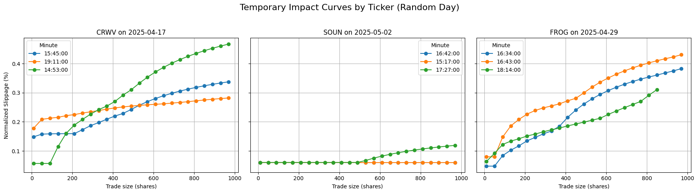

## Modeling Temporary Market Impact

### Problem Setup

We are given high-frequency limit order book data for three tickers: `CRWV`, `SOUN`, and `FROG`. Our objective is not to optimize a specific trading strategy, but to **characterize and model temporary price impact** (slippage) as a function of trade size and market conditions.

We define the **temporary slippage function** for a trade of size \( x \) executed at time \( t \) as:

\[
g_t(x) := \text{average slippage (in dollars or \%) incurred when trading } x \text{ shares at time } t.
\]

Our goal is to:
- Understand how \( g_t(x) \) behaves across different tickers and times,
- Evaluate how well different models fit the observed behavior,
- Discuss implications for volume allocation over time.

---

### Data Normalization

To ensure comparability across tickers, we normalize slippage by the **midprice** at each time \( t \). The normalized slippage becomes:

\[
\tilde{g}_t(x) := \frac{g_t(x)}{P_{\mathrm{mid}, t}}
\]

expressed as a percentage. This standardization helps account for differences in stock price magnitude across tickers.

---

### Empirical Observations

We visualize \( \tilde{g}_t(x) \) across random 1-minute intervals for each ticker and day. Key findings include:

- **Slippage increases nearly monotonically** with trade size, as expected.
- Some minutes exhibit near-flat curves (indicating deep liquidity), while others show rapid slippage growth (indicating shallow books).
- There is significant **intra-day and inter-day variability**, even after normalization.

Below are sample plots of normalized slippage for three tickers:

  
  

---

### Modeling Approach

We propose a **ReLU-style piecewise-linear model** to describe the normalized temporary slippage function:

\[
\tilde{g}_t(x) =
\begin{cases}
0, & x \leq x_0 \\
\eta_{t, s} \cdot (x - x_0), & x > x_0
\end{cases}
\]

where:
- \( \tilde{g}_t(x) \) is the **normalized slippage** at time \( t \),
- \( x \) is the trade size (in shares),
- \( x_0 \) is a **liquidity threshold**: the trade size that can be absorbed without significant impact,
- \( \eta_{t, s} \) is a **slope parameter** encoding market impact per unit of excess volume beyond \( x_0 \). \( \eta_{t, s} \) is time-varying, which allows it to reflect intra-day market conditions, such as volatility, spread width, and depth; it is also ticker-specific where \( s \) indexes the ticker.

---

#### Motivation

This model reflects two key stylized facts observed in our exploratory analysis:

1. **Flat region for small trades**: Small orders—often the first executed within each minute—exhibit near-zero slippage.  
2. **Linear growth afterward**: Once available liquidity near the midprice is consumed, slippage grows approximately linearly with trade size.

The ReLU function captures this behavior: flat response until a threshold is reached, followed by linear increase. It provides a simple and interpretable form aligned with order book dynamics.

---

#### Advantages

- **Interpretability**: Parameters \( x_0 \) and \( \eta_t \) have clear economic meaning — how much liquidity is available at minimal cost, and how costly it is to exceed that.
- **Robustness**: The piecewise-linear form avoids overfitting and generalizes well across different times and tickers.
- **Market Microstructure Alignment**: Matches the observed structure of order books, where liquidity is deep near the midprice but becomes sparse at larger volumes.

---

#### Limitations

- **Non-smooth transition**: The kink at \( x_0 \) may not reflect the gradual nature of real-world transitions from low to high slippage.
- **Estimation challenge**: Identifying the optimal threshold \( x_0 \) per minute requires careful fitting and model selection.
- **No concavity**: Unlike power-law models, this form lacks diminishing marginal impact beyond the threshold, which may understate curvature in aggregated data.

---

### Possible Approaches

- **Empirical Learning**: Fit \( g_{t,s}(x) \) curves on historical data and use them to guide execution on unseen tickers. Learn typical values of \( x_0 \) and \( \eta_{t,s} \) as functions of features like:
  - Bid-ask spread,
  - Top-of-book depth,
  - Trade volume volatility.

- **Execution Optimization**: Formulate volume allocation as a constrained optimization problem:

\[
\min_{\{x_t\}} \sum_t g_t(x_t), \quad \text{subject to } \sum_t x_t = X_{\text{total}}
\]

where \( x_t \) is the volume allocated at minute \( t \), and \( g_t(x_t) \) is the modeled impact.

- **Robustness Evaluation**: Assess how stable model parameters are across different days, symbols, or regimes (e.g., open vs. close).

- **Simulation Testing**: Use historical data to simulate trading strategies based on fitted \( g_{t,s}(x) \), comparing naive, smoothed, and optimized execution paths.

---

### Summary

By analyzing normalized impact curves across time and tickers, we observe consistent microstructure patterns: a flat-slippage region up to a liquidity threshold, followed by linear or concave cost growth. We propose a ReLU-style model that captures this behavior with interpretable parameters and minimal complexity.

This modeling foundation supports two complementary paths forward:
- **Empirical prediction** of impact parameters from market features,
- **Optimization-based scheduling** of execution to minimize aggregate slippage.

Together, they enable the design of data-driven execution strategies that adapt to real-time market conditions while remaining robust and interpretable.
